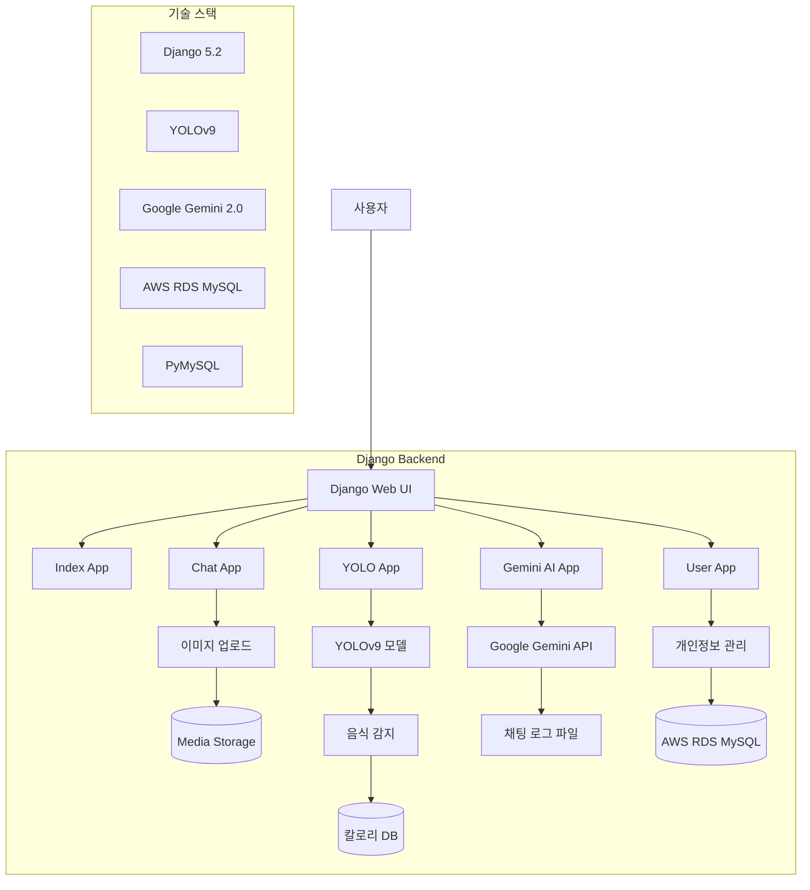
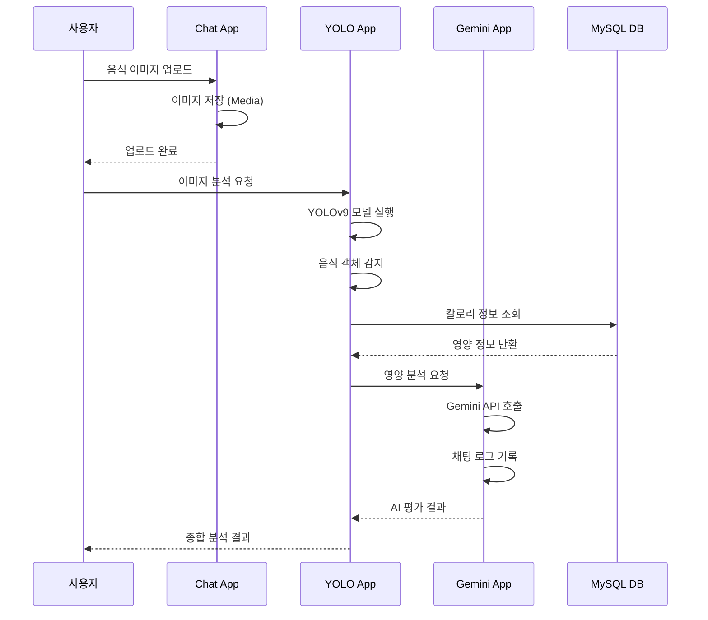
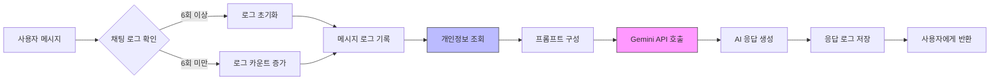

# Health Care 프로젝트 플로우차트

## 전체 시스템 플로우

## 음식 분석 플로우

## Gemini 챗봇 플로우

## 주요 기능
- Django 기반 웹 애플리케이션
- YOLOv9를 활용한 음식 이미지 인식
- Google Gemini AI 챗봇 (페르소나 기반)
- AWS RDS MySQL 데이터베이스
- 사용자 개인정보 기반 맞춤 영양 분석
- 세션 기반 채팅 로그 관리
