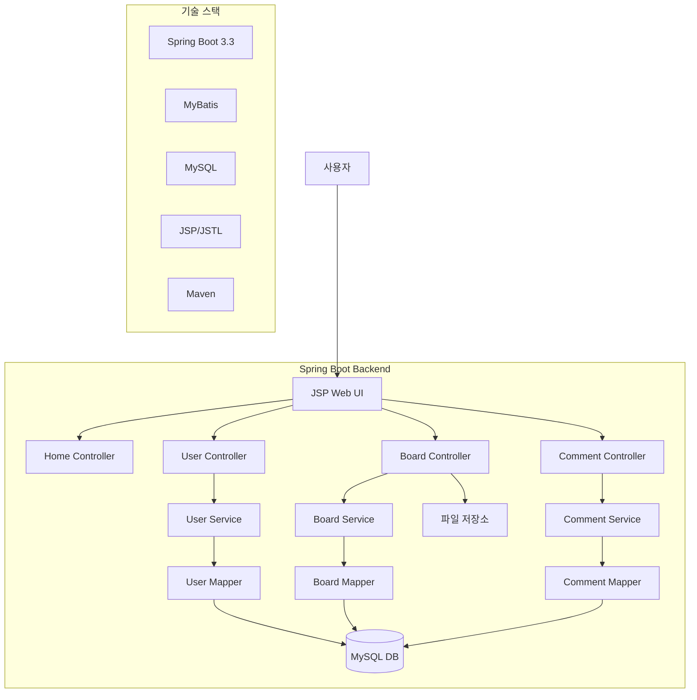
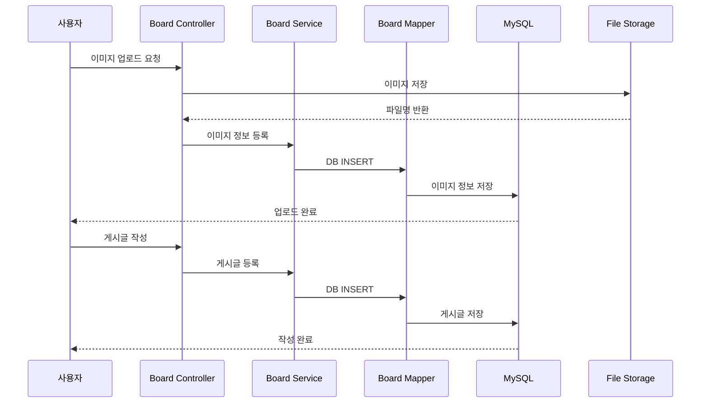
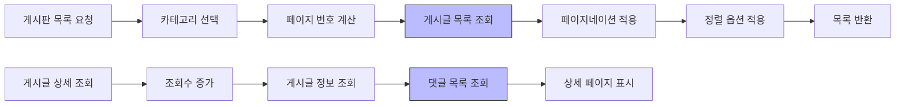
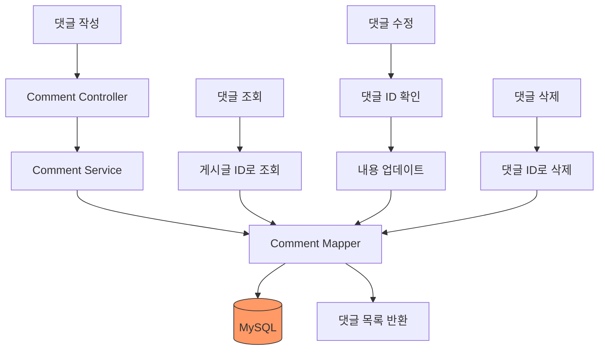
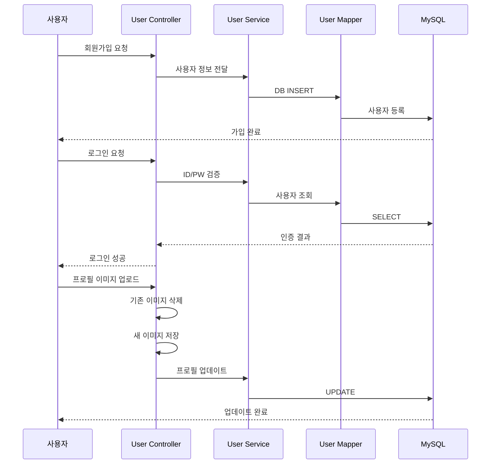

# Jicbak 프로젝트 플로우차트

## 전체 시스템 아키텍처

## 게시판 작성 플로우

## 게시판 조회 플로우

## 댓글 관리 플로우

## 사용자 관리 플로우

## 주요 기능
- Spring Boot 기반 게시판 시스템
- MyBatis를 활용한 데이터베이스 연동
- 카테고리별 게시글 관리
- 페이지네이션 및 정렬 기능
- 이미지 업로드 및 관리
- 댓글 CRUD 기능
- 사용자 인증 및 프로필 관리
- 조회수 카운팅
