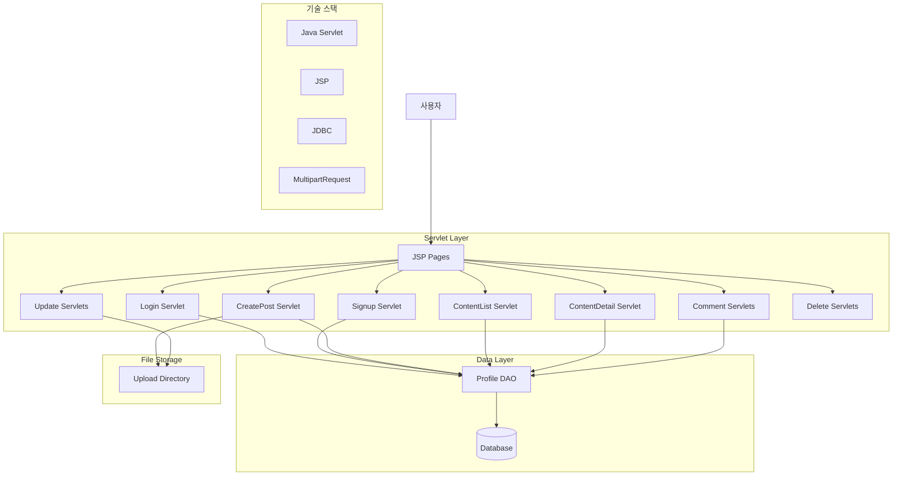
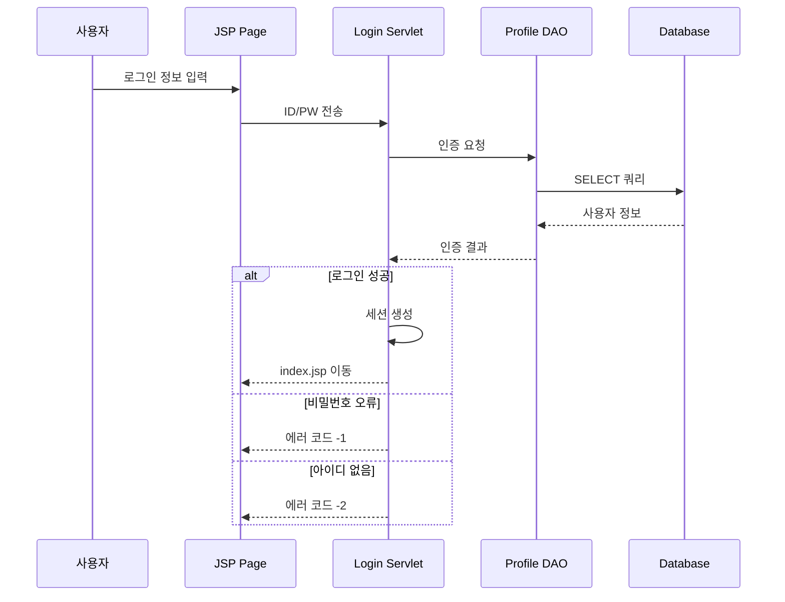
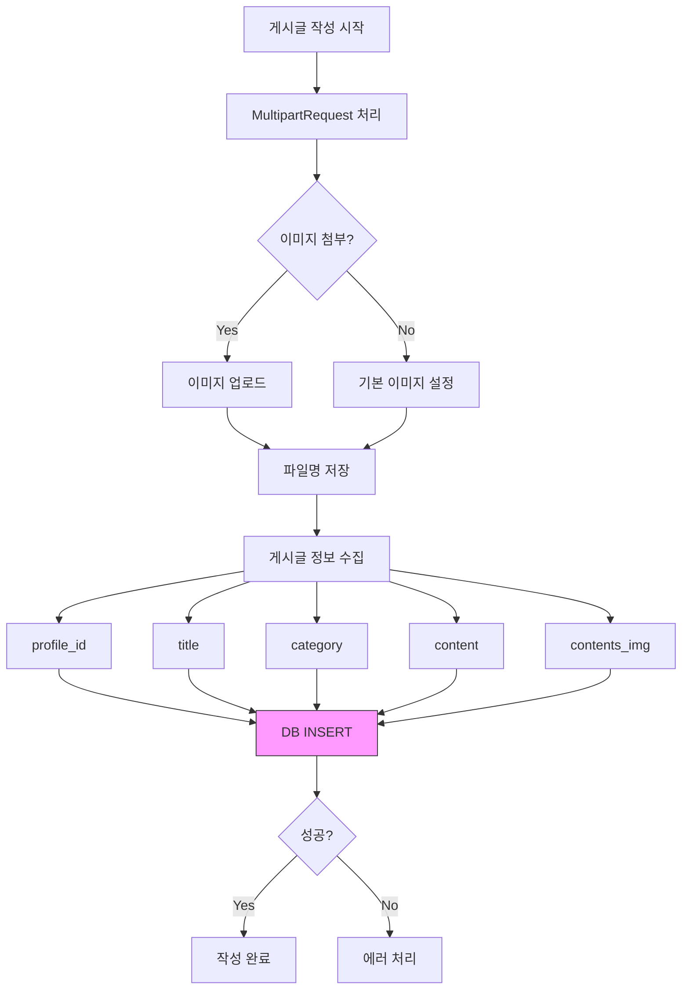
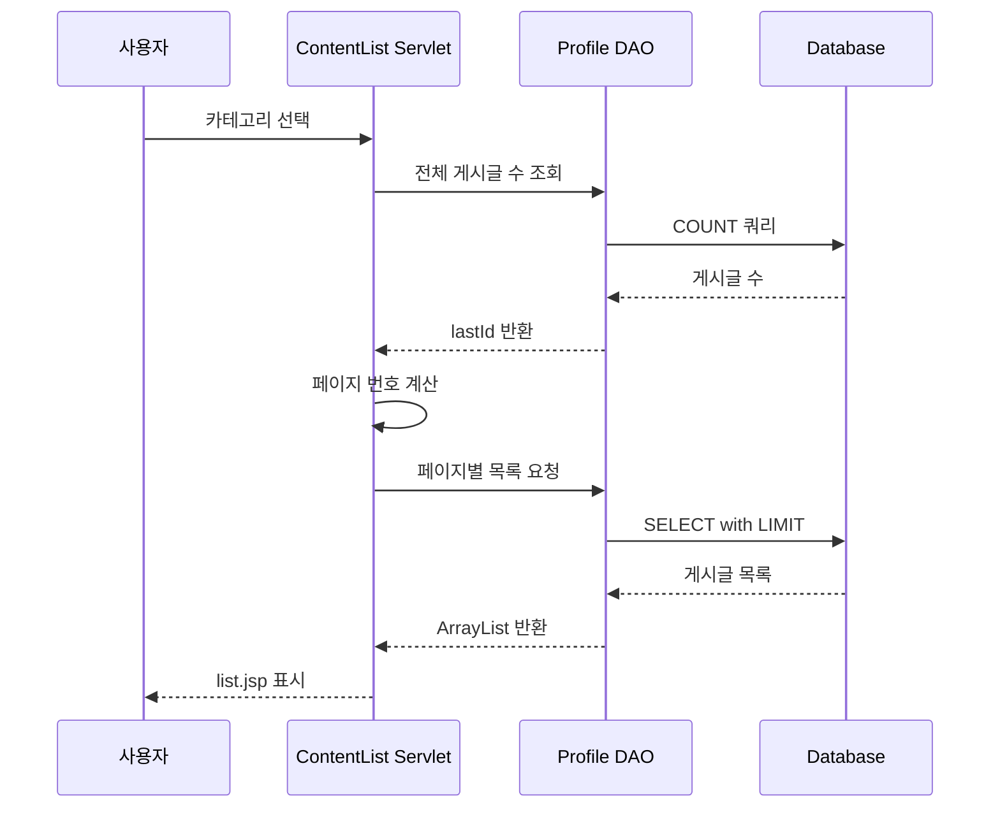
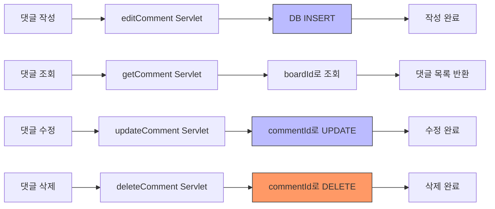
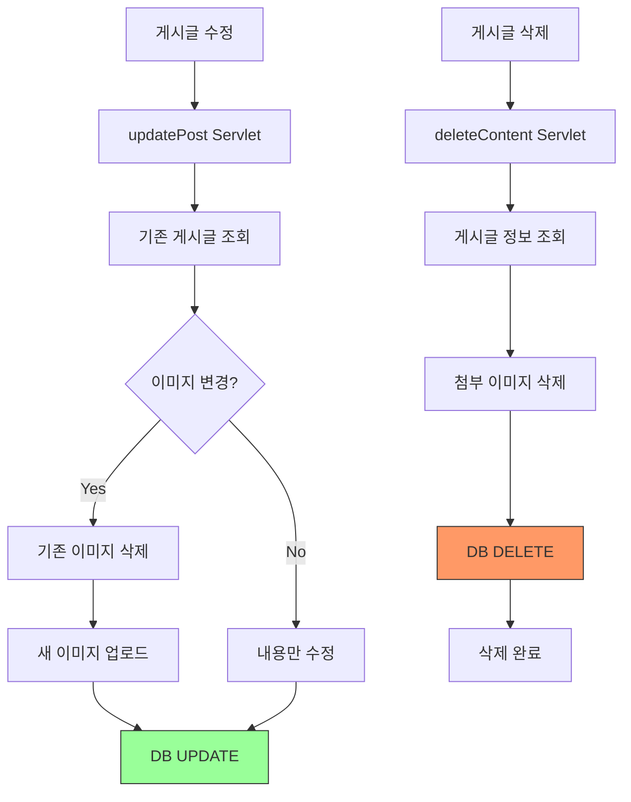

# Notice Board 프로젝트 플로우차트

## 전체 시스템 아키텍처

## 사용자 인증 플로우

## 게시글 작성 플로우

## 게시글 목록 조회 플로우

## 댓글 관리 플로우

## 게시글 수정/삭제 플로우

## 주요 기능
- Java Servlet 기반 게시판
- JSP를 활용한 뷰 렌더링
- JDBC 직접 연결 방식
- MultipartRequest를 통한 파일 업로드
- 카테고리별 게시글 분류
- 페이지네이션 (5개씩)
- 댓글 CRUD 기능
- 세션 기반 사용자 인증
- 이미지 업로드 및 관리
