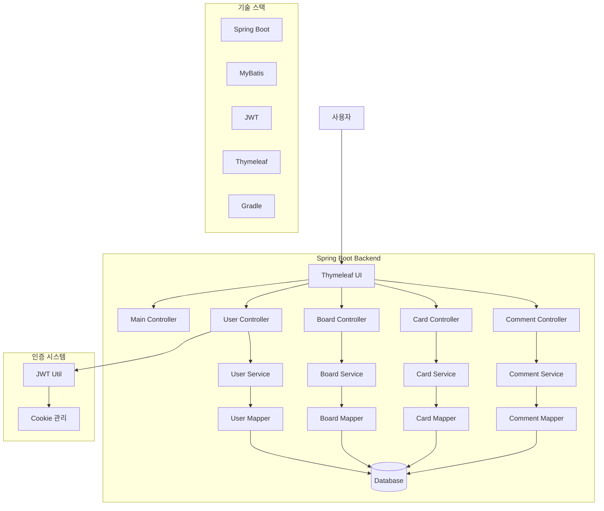
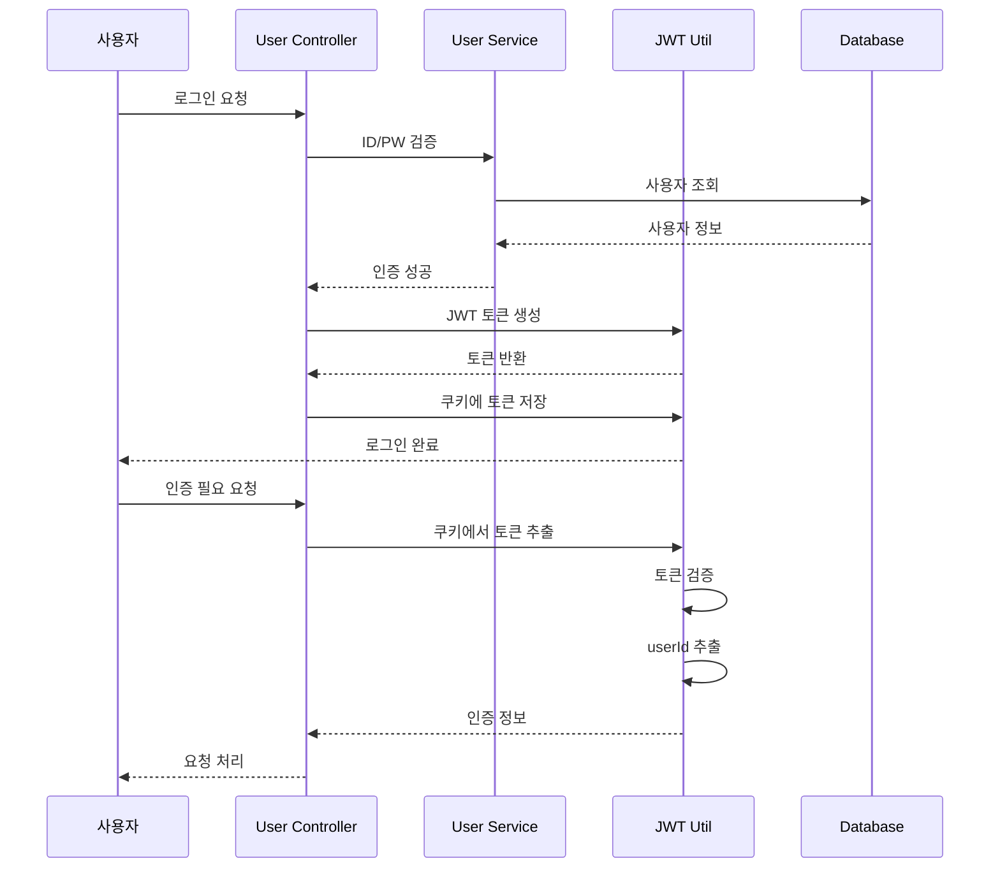
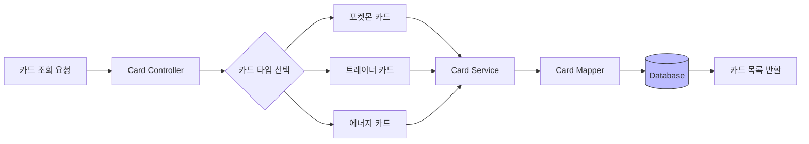
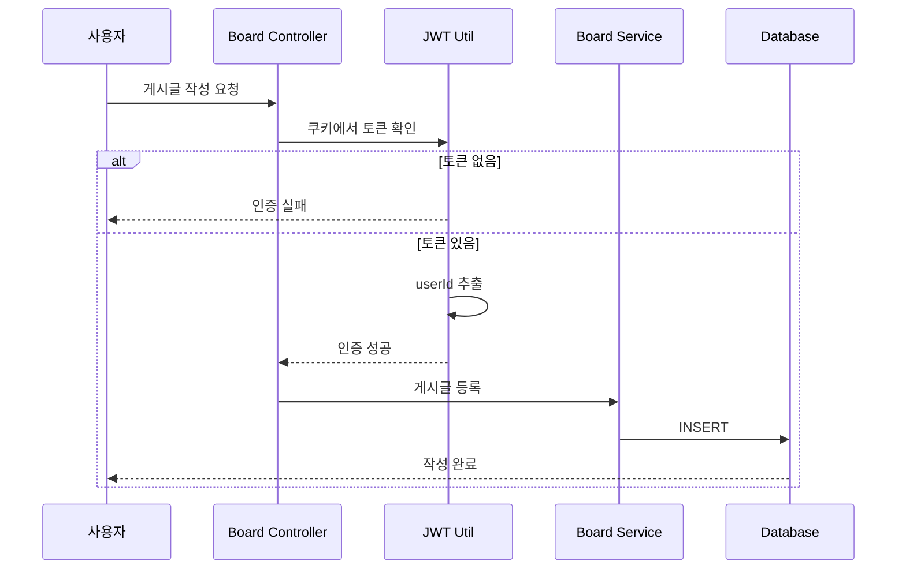
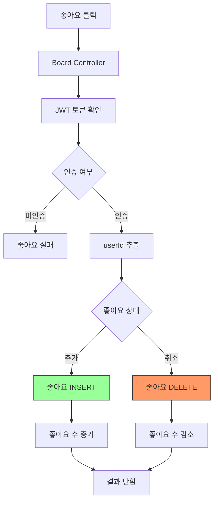
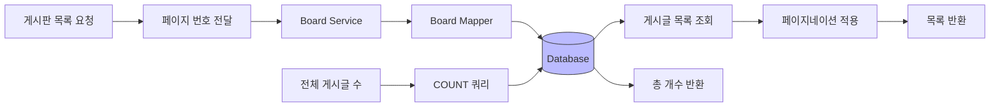
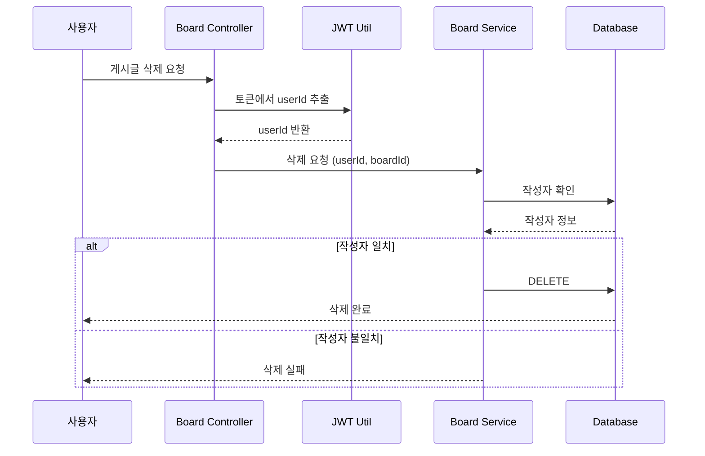
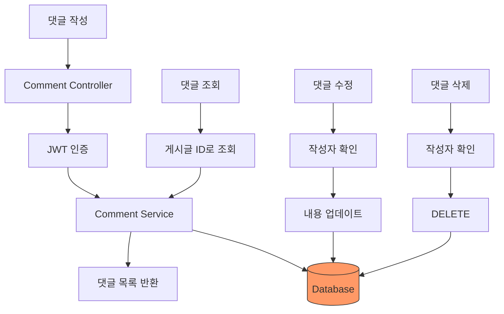

# Pokemon Decksplorer 프로젝트 플로우차트

## 전체 시스템 아키텍처

## JWT 인증 플로우

## 카드 조회 플로우

## 게시글 작성 플로우

## 좋아요 기능 플로우

## 게시판 목록 조회 플로우

## 게시글 삭제 플로우

## 댓글 관리 플로우

## 주요 기능
- Spring Boot 기반 포켓몬 덱 공유 플랫폼
- JWT 기반 인증 시스템
- 쿠키를 통한 토큰 관리
- MyBatis를 활용한 데이터베이스 연동
- 포켓몬 카드 타입별 조회
- 게시글 CRUD 기능
- 좋아요 기능
- 댓글 시스템
- 페이지네이션
- Thymeleaf 템플릿 엔진
